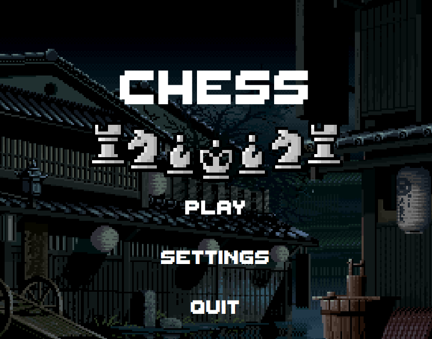
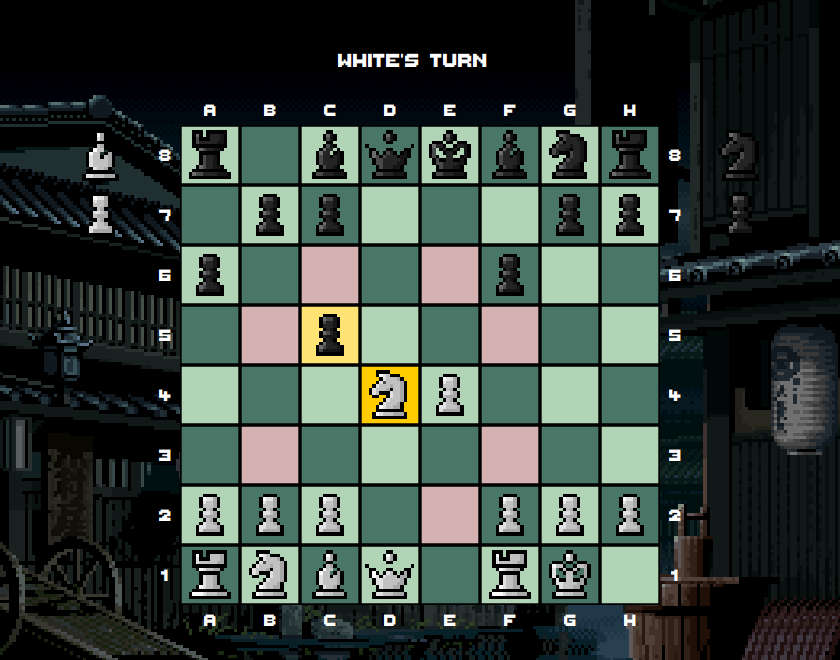

# Chess

A chess game written in Java with a JavaFX interface. Play two players on one computer or against a bot, with an optional chess clock and a review screen that walks through the game with an evaluation bar.

  
  

## Features

- All the rules of chess, written from scratch without chess libraries: castling, en passant, promotion, check, checkmate, stalemate, threefold repetition, the 50-move rule and insufficient material
- Drag-and-drop pieces, highlighted legal moves, captured pieces and a material count
- Play against a bot as white, black or a random color. The bot uses the online engine at [chess-api.com](https://chess-api.com)
- Optional chess clock, 1 to 60 minutes per player
- Review a finished game move by move, with the engine's evaluation for every position
- Sound effects and background music

## Project structure

| Folder | What's inside |
|---|---|
| `chess/` | The game logic: board, pieces, move validation and the rules. Plain Java with no UI. `chess.Main` runs a text version in the console. |
| `chessFX/` | The javaFX app: `chessFX` (screens, board, clock, review), `engine` (FEN conversion and the connection to the engine), and the images, sounds and font. |

## Running it

You need JDK 22 or newer and the [JavaFX SDK 21](https://gluonhq.com/products/javafx/).

1. In Eclipse, choose **File → Import → Existing Projects into Workspace** and import both `chess` and `chessFX`.
2. Create a user library named `javaFX` (**Window → Preferences → Java → Build Path → User Libraries**) and add the jars from the `lib` folder of the JavaFX SDK.
3. Run `chessFX.Main`.

The bot needs an internet connection. Without one the game still works, and the bot plays a random legal move instead.

## Credits

   In the final stage I used AI tools to find and fix bugs.
